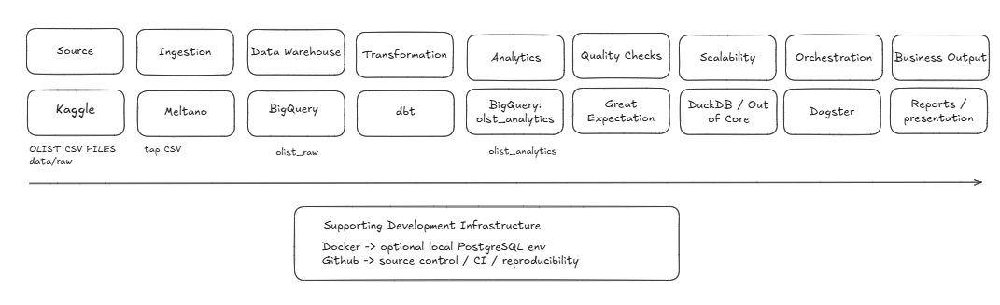

# Olist Data Platform

End-to-end data engineering project on the [Brazilian E-Commerce dataset by Olist](https://www.kaggle.com/datasets/olistbr/brazilian-ecommerce): ingestion → warehouse → dbt star schema → data-quality gates → Python analysis → Dagster orchestration → executive report.

Two business cases drive the design: **sales readiness** (when, what, where, for whom, with which sellers) and **delivery readiness** (where deliveries are long or late and what shortens them). See `docs/report.md` for findings and `docs/presentation_outline.md` for the deck.



| Stage | Tool | Where in the repo |
|---|---|---|
| Ingestion | Meltano `tap-csv → target-bigquery`, or Python loaders (DuckDB / BigQuery) | `ingestion/` |
| Warehouse | BigQuery (cloud) **and** DuckDB (local, out-of-core) from one codebase | `dbt/olist_dbt/profiles.yml` |
| Transformation | dbt — staging views → star schema → business marts | `dbt/olist_dbt/models/` |
| Quality | 96 dbt tests + 28 Great Expectations | `dbt/olist_dbt/tests/`, `quality/` |
| Analysis | SQLAlchemy + pandas + matplotlib notebooks | `analysis/` |
| Orchestration | Dagster asset graph (daily schedule) + GitHub Actions CI | `orchestration/`, `.github/workflows/` |
| Docs | Schema justification, report, presentation outline | `docs/` |

## Quick start (local, no cloud account)

**macOS / Linux**

```bash
git clone https://github.com/<you>/olist-data-platform.git
cd olist-data-platform
python3 -m venv .venv && source .venv/bin/activate
pip install -r requirements.txt

# Put the nine Kaggle CSVs in data/raw/
# (or: kaggle datasets download -d olistbr/brazilian-ecommerce -p data/raw --unzip)

make all          # ingest → dbt run → dbt test → Great Expectations → charts (≈ 1 minute)
```

**Windows (PowerShell)**

```powershell
git clone https://github.com/<you>/olist-data-platform.git
cd olist-data-platform
python -m venv .venv
.\.venv\Scripts\Activate.ps1
pip install -r requirements.txt

# Put the nine Kaggle CSVs in data\raw\

.\run_all.ps1     # same pipeline; add -Clean to rebuild from scratch
```

Step-by-step Windows walkthrough, including GitHub and CI: **`docs/RUNBOOK_WINDOWS.md`**.

`make all` is equivalent to:

```bash
python ingestion/load_raw_duckdb.py                     # raw layer, schema olist_raw
cd dbt/olist_dbt && export DBT_PROFILES_DIR=.           # dbt project
dbt run  --target duckdb                                # 8 staging views + 12 analytics tables
dbt test --target duckdb                                # 96 tests (expect PASS=94 WARN=2)
cd ../.. && python quality/run_great_expectations.py    # 28 expectations -> quality/gx_results.json
cd analysis && python run_analysis.py                   # charts + kpis.json in analysis/outputs/
```

Then open the notebooks:

```bash
jupyter lab analysis/notebooks/01_sales_readiness.ipynb
```

## Orchestrated run (Dagster)

```bash
cd orchestration
dagster dev -f olist_dagster/definitions.py     # http://localhost:3000 — click "Materialize all"
# or headless:
dagster job execute -f olist_dagster/definitions.py -j olist_daily_job
```

The graph has 31 assets (9 raw tables → 8 staging → 12 marts → quality gate → analysis outputs) and a daily 06:00 schedule.

## Cloud run (BigQuery)

```bash
pip install dbt-bigquery google-cloud-bigquery sqlalchemy-bigquery
gcloud auth application-default login
export GCP_PROJECT_ID=<your-project>

python ingestion/load_raw_bigquery.py                    # or: cd ingestion && meltano install && meltano run tap-csv target-bigquery
cd dbt/olist_dbt && DBT_PROFILES_DIR=. dbt build --target bigquery
WAREHOUSE=bigquery python quality/run_great_expectations.py
WAREHOUSE=bigquery python analysis/run_analysis.py
```

Nothing else changes: the same dbt models, tests, expectations, notebooks and Dagster graph run on BigQuery via the `DBT_TARGET` / `WAREHOUSE` environment variables.

## Repository layout

```
ingestion/        meltano.yml, load_raw_duckdb.py, load_raw_bigquery.py
dbt/olist_dbt/    dbt project (models/staging, models/marts/core, models/marts/business, tests, macros)
quality/          run_great_expectations.py  (writes gx_results.json)
analysis/         warehouse.py (SQLAlchemy), run_analysis.py, notebooks/, outputs/
orchestration/    olist_dagster/definitions.py
docs/             schema_design.md, report.md, presentation_outline.md, images/
.github/          workflows/ci.yml  (full pipeline on push, PR and nightly)
data/             raw/ (CSVs, git-ignored) and warehouse/ (DuckDB file, git-ignored)
```

## Data quality summary

| Suite | Checks | Result |
|---|---|---|
| dbt schema tests (unique / not-null / relationships / accepted values / composite keys) | 91 | pass |
| dbt singular tests (negative money, delivery before purchase, rank bounds, …) | 5 | 3 pass, 2 warn |
| Great Expectations (fact_orders, fact_order_items, dim_customers, dim_products, monthly_sales, customer_metrics) | 28 | pass |

The two warnings are documented source-data defects (8 "delivered" orders without a delivery date; 246 orders whose payment differs from items + freight by more than R$1) — see `docs/report.md` §4.

## Key findings (details in `docs/report.md`)

- Revenue peaks in **November** (Black Friday, R$ 1.17 m in Nov 2017); 2018 is running ahead of 2017.
- **21 products** are in the monthly top-50 six or more months — the always-stock core.
- **SP = 38 %** of revenue; SP + RJ + MG = 63 %.
- **Gold customers = 13 % of customers, 30 % of revenue**, over-indexing on watches & gifts and health & beauty. Only 3 % of customers ever re-order.
- Delivery averages **12.5 days, 8.1 % late**; the North/North-East take 2–3× longer and Alagoas/Maranhão are 20–24 % late. **Seller handling is 2.7 days everywhere; the whole gap is carrier transit.** Late orders score 2.6 vs 4.3 on reviews.
