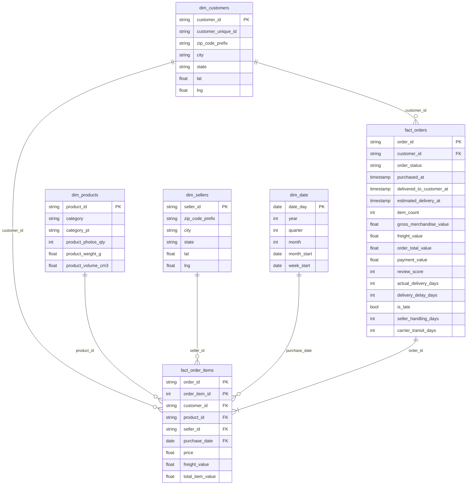

# Data Warehouse Design

## Layers

| Layer | Schema / dataset | Materialisation | Purpose |
|---|---|---|---|
| Raw | `olist_raw` | tables, all columns STRING | Faithful copy of the nine Kaggle CSVs. Never edited; re-loadable. |
| Staging | `olist_staging` | views | One view per raw table. Casts types, trims/normalises text, deduplicates reviews, collapses 1 M geolocation rows to one centroid per zip prefix. |
| Analytics (core) | `olist_analytics` | tables | The star schema: 4 dimensions + 2 facts. |
| Analytics (business) | `olist_analytics` | tables | Pre-aggregated marts that answer the two business cases directly. |

Landing everything as strings, then typing in staging, is deliberate. Meltano's `tap-csv` emits strings, so the raw layer looks identical whether it was loaded by Meltano into BigQuery or by `load_raw_duckdb.py` into DuckDB, and every downstream model is portable between the two targets without change.

## Star schema



### Business marts built on the star

| Mart | Grain | Business question |
|---|---|---|
| `monthly_sales` | month | Monthly sales trend, AOV, late-rate trend |
| `top_products_monthly` | month × product (rank ≤ 50) | "Top 50 products for each month" |
| `category_region_sales` | month × category × customer state | "Which categories and region" |
| `customer_metrics` | customer (person) | Lifetime spend, RFM scores, `customer_segment` incl. **gold** |
| `seller_performance` | seller | Which sellers to prepare for stronger demand |
| `delivery_performance_by_state` | customer state | Where deliveries are long or late; seller vs carrier leg |

## Design justification

**Why a star schema and not the raw 3NF tables.** The business questions are all "measure by dimension" questions — revenue by month, by category, by state, by segment. A star lets every one of them be a single join from a fact to a dimension with no chains through `orders → customers → geolocation`. That is what BigQuery and DuckDB optimise best: wide, denormalised dimensions and a narrow fact scanned column-wise.

**Two facts at two grains.** `fact_order_items` is the atomic sales fact (one row per line) and is the only correct place to attribute revenue to a product or seller. `fact_orders` is the order grain, which is where delivery timestamps, payments and the review live — none of those are meaningful per line. Keeping both avoids the classic error of double-counting freight or reviews when summing at the wrong grain. `fact_orders` also carries `customer_state` denormalised so the delivery mart needs no join at all.

**Natural keys rather than surrogate keys.** Olist's ids are already opaque 32-character hashes, immutable and unique. Adding surrogate integers would add a join step and a lookup at load time with no analytical benefit for a batch, non-SCD dataset. If the pipeline moved to incremental loads with changing dimensions, `dbt_utils.generate_surrogate_key` plus snapshots would be the next step.

**`customer_id` vs `customer_unique_id`.** Olist mints a new `customer_id` per order; `customer_unique_id` identifies the person. The dimension is keyed on `customer_id` (that is what the facts reference) and carries `customer_unique_id`, and `customer_metrics` aggregates to the person. This is the single most important modelling decision for the segmentation case — using `customer_id` would make every customer look like a one-time buyer.

**Derived measures computed once in dbt, not in every notebook.** `total_item_value`, `order_total_value`, `is_late`, `delivery_delay_days`, `seller_handling_days`, `carrier_transit_days`, lifetime value and RFM scores are all materialised in the warehouse. Analysts get consistent numbers, and the tests protect them.

**Geolocation collapsed at staging.** The raw file is 1 M rows of repeated coordinates. Averaging to one centroid per zip prefix (after filtering to Brazil's bounding box) turns a 1 M-row join into a 19 k-row lookup and removes obvious data-entry errors.

**Portability.** Every non-standard SQL function goes through dbt's cross-database macros (`dbt.date_trunc`, `dbt.datediff`, `dbt.type_int`, `dbt.date_spine`), so `dbt build --target duckdb` and `dbt build --target bigquery` compile the same models.

## Query efficiency

Typical dashboard query on the star:

```sql
select d.month_start, p.category, c.state, sum(f.price) as revenue
from olist_analytics.fact_order_items f
join olist_analytics.dim_date      d on f.purchase_date = d.date_day
join olist_analytics.dim_products  p on f.product_id    = p.product_id
join olist_analytics.dim_customers c on f.customer_id   = c.customer_id
group by 1, 2, 3
```

On BigQuery, `fact_order_items` should be partitioned by `purchase_date` and clustered by `product_id, seller_id` (add `partition_by` / `cluster_by` to the model config); on DuckDB the columnar storage already reads only the referenced columns. The pre-aggregated marts mean the two business cases never touch the facts at query time at all.
